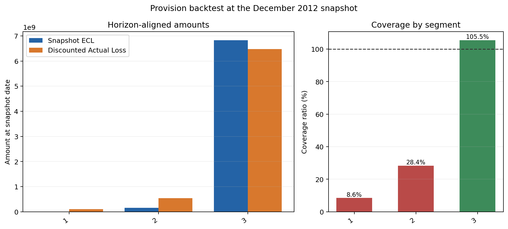
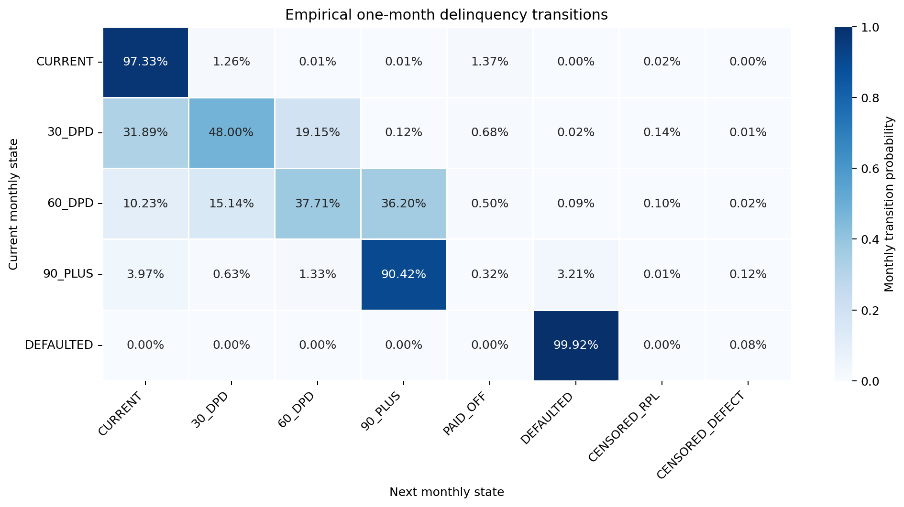
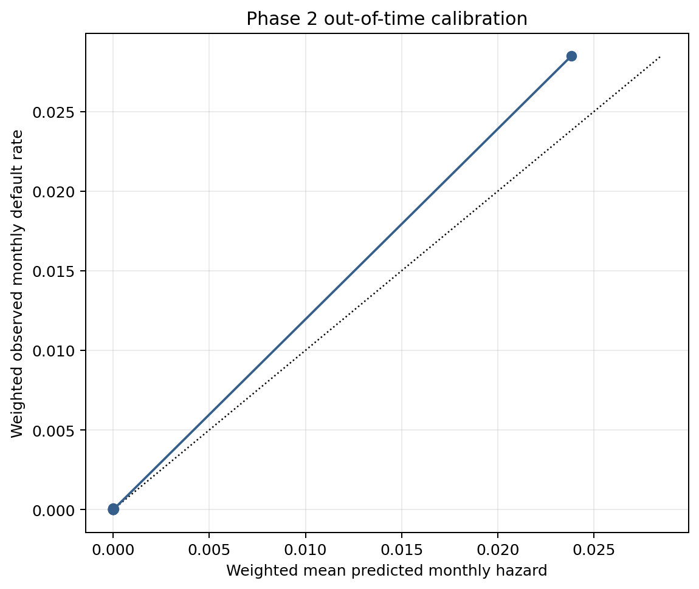
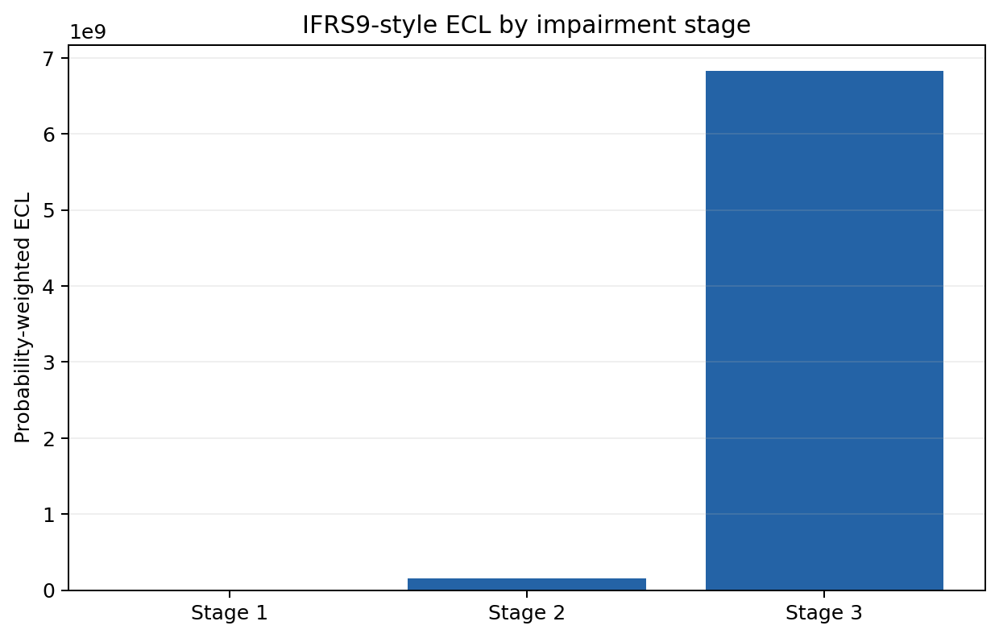

# IFRS9 Expected Credit Loss Engine

[](https://github.com/JAYANSHUBADLANI/ifrs9-ecl-engine/actions/workflows/pytest.yml)

I built this project as an interview-focused, IFRS9-style expected credit loss engine for
Freddie Mac mortgages originated from 2005Q1 through 2007Q4. It streams the supplied loan
archives, constructs monthly credit histories, estimates PD, LGD, and EAD, assigns impairment
stages, calculates scenario-weighted ECL, and backtests the December 2012 provision against
subsequent disclosed losses.

This is a research implementation, not a production accounting opinion. The portfolio is
secured mortgage credit, the sample is bounded, and several model choices are deliberately
simple and transparent.

## Result at a glance

All five analytical phases are complete on a deterministic stratified sample of 120,000
loans, with 10,000 loans from each origination quarter. Quarterly expansion weights scale
aggregate results back to the 4,043,191-loan source population.

| Measure | Result |
|---|---:|
| Sampled monthly records | 8,068,208 |
| December 2012 snapshot loans | 36,962 |
| Stage 1 loans | 31,521 |
| Stage 2 loans | 1,923 |
| Stage 3 loans | 3,518 |
| Sample probability-weighted ECL | 214.66 million |
| Expansion-weighted ECL | 6.994 billion |
| Horizon-aligned discounted realized loss | 7.121 billion |
| Horizon-aligned coverage ratio | 98.22% |
| Horizon-aligned provision gap | 126.71 million shortfall |

The primary backtest uses comparable horizons. Stage 1 is evaluated against losses in the
next 12 months, Stage 2 against losses within its modeled remaining lifetime, and Stage 3
against resolved losses through the March 2026 data cutoff. An all-stage, all-years stress
diagnostic produces 8.496 billion of discounted losses and 82.32% coverage. I do not present
that stress view as a fair Stage 1 accuracy test because 12-month ECL cannot be compared with
more than 13 years of losses on equal terms.



## Pipeline

| Phase | Implementation | Real-data evidence |
|---|---|---|
| 1 | ZIP streaming, panel construction, data audit, roll rates | 120,000 loans and 8.07 million monthly rows |
| 2 | Weighted discrete-time default hazard and lifetime PD | 1.16 million development rows and 526,335 OOT rows |
| 3 | Cure model, conditional severity LGD, amortizing EAD | Cure, severity, and EAD validated out of time |
| 4 | SICR staging, monthly discounted ECL, three scenarios | 36,962 reporting-date loans |
| 5 | Horizon-aligned provision backtest | 2,555 later loss events |

The implementation checkpoints each quarter, keeps every disclosed default event and
delinquent non-event in model development, and samples only CURRENT development non-events.
Inverse selection weights correct that case-control sampling, while quarterly expansion
weights address the stratified loan sample.

## Data contract and audit

The supplied archives are Freddie Mac Release 47, effective July 2026. They contain 31
headerless origination fields and 35 performance fields, not the older 32-field layouts.
Across all 12 archives, the source contains 4,043,191 originations and 31.345 GB of
uncompressed data. The pipeline streams ZIP members directly because extracting everything
would exceed the available data-volume capacity.

I preserve explicit CURRENT, 30_DPD, 60_DPD, 90_PLUS, PAID_OFF, DEFAULTED, RPL-censored,
defect-censored, and UNKNOWN states. Code 15 is a loss-bearing default disposition. Code 16
is a reperforming-loan exit and is censored. Transition estimates use only consecutive
calendar-month pairs and never synthesize absorbing rows.

The full sample produced 7,948,131 usable adjacent transitions, no duplicate loan-months,
and no unknown states. Key expansion-weighted transition probabilities were:

| Transition | Probability |
|---|---:|
| CURRENT to 30 DPD | 1.2551% |
| 30 DPD to CURRENT | 31.8863% |
| 30 DPD to 60 DPD | 19.1485% |
| 60 DPD to 90 plus | 36.1994% |
| 90 plus to DEFAULTED | 3.2096% |



I reconciled all 8,487 disclosed Actual Loss rows within one cent using the Release 47 sign
contract:

```text
Actual Loss = Zero Balance Removal UPB
            + Net Sales Proceeds
            + Delinquent Accrued Interest
            + Total Expenses
            + MI Recoveries
            + Non-MI Recoveries
```

Recoveries and gains are negative. Expenses and losses are positive. Total Expenses is used
instead of adding it to its component expense fields, which would double count expenses.
The exact field order and official sources are in `docs/data_dictionary.md`.

## PD model

I fit a weighted monthly logistic hazard model using reporting-month information only. The
model converged in 63 of 1,000 allowed iterations. Development contained 1,157,886 rows and
4,355 default events. Calendar out-of-time validation covered January through December 2012:

| OOT metric | Result |
|---|---:|
| Rows | 526,335 |
| Default events | 1,520 |
| Weighted ROC AUC | 0.96685 |
| Weighted average precision | 0.04765 |
| Weighted Brier score | 0.002694 |
| Weighted event rate | 0.2802% |
| Weighted mean prediction | 0.2334% |

The high ROC AUC shows strong rank ordering, but average precision remains low because next
month default is rare. Mean prediction is also below the observed event rate. I therefore do
not describe this as a fully calibrated production PD model.

Monthly hazards are converted into survival, marginal PD, and cumulative PD curves. Curves
advance loan age and stop at remaining legal maturity. Current and origination-reference
curves use the same snapshot age and horizon so the SICR ratio is like for like.



## LGD and EAD

A cure requires three consecutive adjacent CURRENT months within 12 months. The cure model
converged in 77 iterations. Its OOT ROC AUC was 0.63141, but it predicted a 62.73% weighted
cure rate against 91.20% observed. This is a material calibration weakness.

Conditional severity is fitted on resolved default dispositions with realized LGD between
zero and one. Raw audit values remain signed and unclipped. The severity model converged in
five iterations. OOT weighted observed severity was 51.47%, predicted severity was 55.98%,
and RMSE was 0.23026.

Reporting EAD is interest-bearing UPB plus non-interest-bearing UPB plus delinquent accrued
interest. Future EAD follows fixed-rate scheduled amortization and retains any explicit
snapshot add-on. OOT one-month EAD validation produced MAE 160.66 and RMSE 1,418.05 across
462,388 rows.

## Staging, ECL, and scenarios

Stage 3 takes precedence for explicit defaults or at least 90 DPD. Stage 2 uses a 30 DPD
backstop, a current-to-origination lifetime PD ratio of at least 2.0, or an absolute lifetime
PD increase of at least 5 percentage points. Remaining loans are Stage 1. Stage 1 uses
12-month marginal PD, Stage 2 uses remaining-lifetime marginal PD, and Stage 3 applies
immediate credit-impaired loss.

At the December 2012 snapshot, every loan meeting either quantitative PD trigger was already
delinquent or defaulted, so the PD tests added no incremental Stage 2 loans beyond the DPD
backstops. This is an honest model finding and a weakness of the current survivor snapshot
and origination-reference design, not evidence that SICR modeling is unnecessary.

| Stage and reason | Loans | Expansion-weighted ECL |
|---|---:|---:|
| Stage 1, performing | 31,521 | 8.68 million |
| Stage 2, 30 DPD backstop | 1,923 | 154.52 million |
| Stage 3, 90 DPD backstop | 2,962 | 5.153 billion |
| Stage 3, explicit default | 556 | 1.678 billion |



The scenarios apply transparent constant shifts to monthly hazard odds. They are sensitivity
tests, not external macroeconomic forecasts.

| Scenario | Weight | Hazard-odds multiplier | Expansion-weighted ECL |
|---|---:|---:|---:|
| Upside | 20% | 0.75 | 6.950 billion |
| Base | 60% | 1.00 | 6.986 billion |
| Downside | 20% | 1.60 | 7.065 billion |

## Backtest interpretation

The horizon-aligned portfolio coverage ratio is 98.22%, but this aggregate closeness hides
material stage offsets. Stage 1 coverage is 8.55%, Stage 2 coverage is 28.36%, and Stage 3
coverage is 105.51%. Stage 3 overprovisioning offsets substantial performing and delinquent
underprovisioning. The model is therefore not well calibrated merely because the total is
close to realized loss.

| Stage | ECL | Discounted realized loss | Coverage |
|---|---:|---:|---:|
| 1 | 8.68 million | 101.51 million | 8.55% |
| 2 | 154.52 million | 544.83 million | 28.36% |
| 3 | 6.831 billion | 6.475 billion | 105.51% |
| Total | 6.994 billion | 7.121 billion | 98.22% |

This backtest freezes one reporting date and uses later Freddie Mac disclosures. It is not a
multi-period accounting backtest, and it does not remove survivor bias from observing only
loans still present at the December 2012 snapshot.

## Main limitations

- The dataset contains secured amortizing mortgages, not revolving unsecured cards.
- The sample contains 120,000 loans rather than every monthly history in the population.
- The 2005 to 2007 vintages concentrate housing-crisis risk and do not cover every regime.
- The December 2012 snapshot has survivor selection after the worst crisis years.
- PD, cure, and severity calibration weaknesses remain despite model convergence.
- Quantitative SICR triggers add no incremental performing exposures at this snapshot.
- Scenario shifts are judgmental sensitivity factors without external macro forecasts.
- Reporting conventions change after April 2019 within these long loan histories.
- Stage 3 immediate-loss treatment and a static one-date backtest simplify IFRS 9 practice.

More detail is in `docs/methodology.md` and `docs/scope_and_limitations.md`.

## Repository layout

```text
config/                    Reproducible pipeline and modeling settings
src/ifrs9_ecl/             Streaming ingestion and analytical implementation
tests/                     Unit, malformed-data, and integration tests
docs/                      Release 47 contract, methodology, and limitations
data/processed/            Derived loan-level checkpoints, excluded from Git
artifacts/                 Models, summaries, and aggregate result tables
reports/figures/           Generated aggregate figures
PROGRESS.md                Completed work and verification notes
```

Raw Freddie Mac files and derived loan-level panels are excluded from version control.

## Reproduce the project

Use Python 3.12. Install the tested dependencies:

```bash
python3.12 -m venv .venv
source .venv/bin/activate
python -m pip install -c constraints-tested.txt -e ".[dev]"
```

Set the parent directory containing `historical_data_2005`, `historical_data_2006`, and
`historical_data_2007`, then run the full checkpointed pipeline:

```bash
export FREDDIE_DATA_ROOT=/path/to/freddie/mac/data
make run-all
make test
```

Individual phases can be run with `make phase0`, `make phase1`, `make phase2`, `make phase3`,
`make phase4`, and `make phase5`. Completed quarter checkpoints are reused when their source
signatures and settings match.
